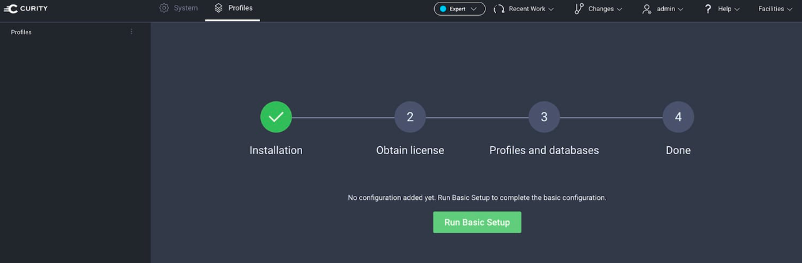
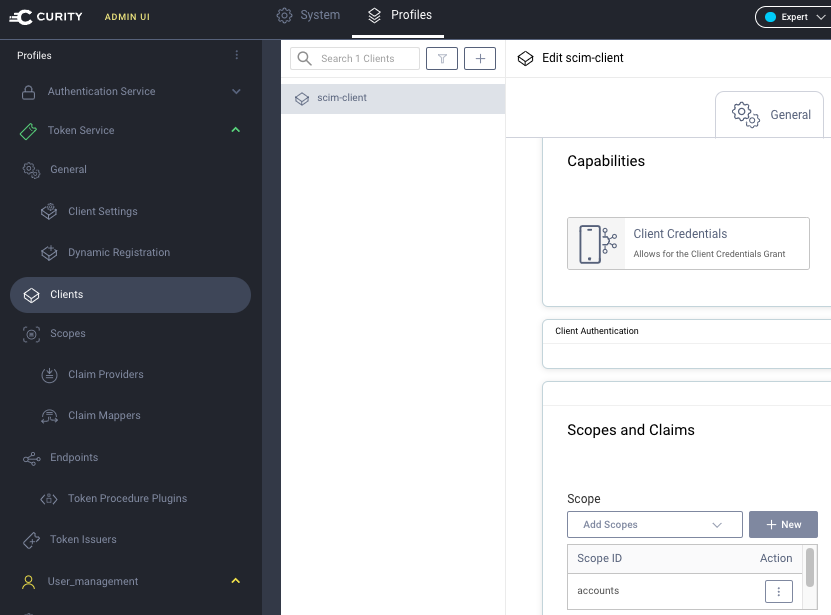

# Authorization Server Deployment

This example deploys an instance of the community edition of the Curity Identity Server.

## Prerequisites

Ensure that your local computer has a Docker engine installed.

## Deploy the Authorization Server

Run the following commands to deploy a Docker based authorization server:

```bash
cd deployment
docker pull curity.azurecr.io/curity/idsvr
docker compose --project-name scim up
```

Then get a community edition license file for the Curity Identity Server.\
Do so by running the following script from the root folder of this repository.\
See the [License README](https://github.com/curityio/book-license-cli) for other options.

```bash
./resources/authorizationserver/license/download-license.sh
```

## Complete the Initial Setup

Go to the admin UI at `https://localhost:6749/admin` and ignore certificate warnings due to the self-signed SSL certificate.\
Sign in with user `admin` and the password `Password1` (configured in the docker compose file).\
Run the basic setup wizard, select `All options`, provide the license file and accept all other defaults.



Then select the `Changes / Commit` menu option, after which the authorization server is ready to use.\
View the [OpenID Connect Metadata](http://localhost:8443/oauth/v2/oauth-anonymous/.well-known/openid-configuration), to get information about the authorization server, like OAuth endpoints.

## Configure SCIM and a SCIM Client

Next, use the `Changes / Upload` menu to merge the `configuration.xml` file, which enables user management endpoints.\
Select the `Changes / Commit` option, after which the system is fully configured.\
The XML file can be studied to understand the configuration:

- A scope called `accounts` enables access to user accounts.
- The SCIM endpoint requires the  `accounts` scope.
- An OAuth client uses the `accounts` scope and the client credentials flow.


