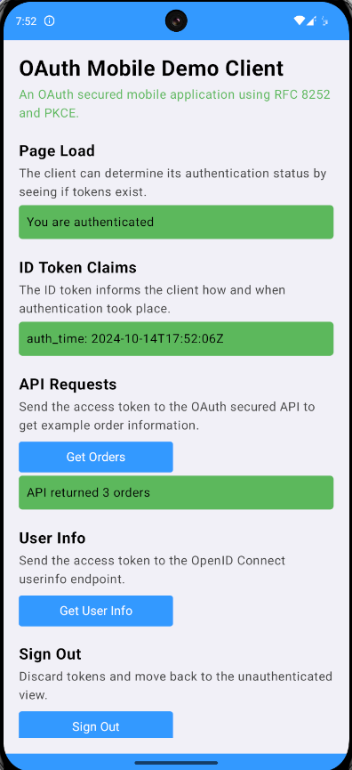

# Android App Code Example

An Android app that runs a code flow to authenticate users and get an access token with which to call APIs.\
The app uses Kotlin with Jetpack Compose.

## Overview

First run [deployment scripts](../README.md) to run backend components in a local Kubernetes cluster.\
Then use Android Studio to run the app on an emulator and sign in using one of these test user accounts:

- User: `dana`, Password: `Password1` (high privilege user)
- User: `kim`, Password: `Password1` (low privilege user)

The app receives its login response using a private-use URI scheme redirect URI.\
After user authentication the app shows how to run API requests, token refresh and basic logout:



## Configuration

The app uses the following configuration, with HTTP endpoints to reduce infrastructure so that you can focus on the code.\
You can repoint the app to your own authorization server that uses HTTPS URLs.

```kotlin
object Configuration {
    const val clientId = "demo-mobile-client"
    const val redirectUri = "com.example.demoapp:/callback"
    const val scope = "openid profile retail/orders"
    const val authorizationServerBaseUrl = "https://login.democluster.example/oauth/v2/oauth-anonymous"
    const val algorithm = "ES256"
    const val apiBaseUrl = "https://api.democluster.example/orders"
}
```

## Local Computer Connectivity

Ideally, you should adapt the mobile app and run it against deployed environments.\
It is possible, but tricky, to run the app on an emulator that connects to these local Kubernetes cluster URLs:

```text
https://login.democluster.example
https://api.democluster.example
```

For further details see the [CONNECTIVITY](CONNECTIVITY.md) document.

## Source Code Overview

The following table summarizes the application's main source files:

| Source File | Description |
| ----------- | ----------- |
| [AndroidManifest.xml](app/src/main/AndroidManifest.xml) | The manifest file enables the private-use URI scheme redirect URI |
| [MainActivity.kt](app/src/main/java/com/example/demoapp/MainActivity.kt) | The app's single activity |
| [MainActivityViewModel.kt](app/src/main/java/com/example/demoapp/MainActivityViewModel.kt) | The activity's view model |
| [OAuthClient.ts](app/src/main/java/com/example/demoapp/oauth/OAuthClient.kt) | Makes OAuth requests |
| [LoginRequestResponseActivity.kt](app/src/main/java/com/example/demoapp/oauth/LoginRequestResponseActivity.kt) | Send a login request using a custom tab and receives the login response using a deep link |
| [ApiClient.kt](app/src/main/java/com/example/demoapp/api/ApiClient.kt) | Makes API requests |
