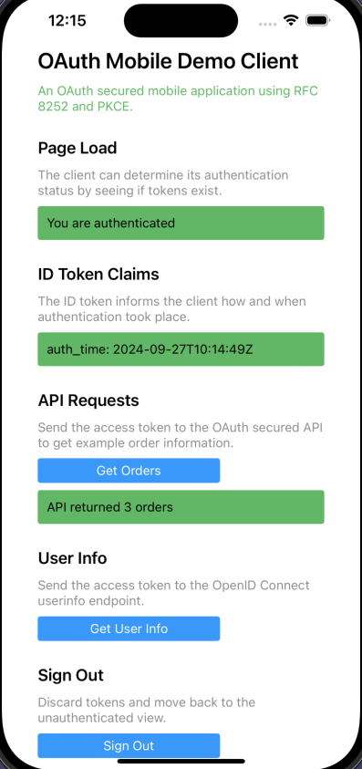

# iOS App Code Example

An iOS app that runs a code flow to authenticate users and get an access token with which to call APIs.\
The app uses Swift and Swift UI.

## Overview

First run [deployment scripts](../README.md) to run backend components in a local Kubernetes cluster.\
Then use Xcode to run the iOS app on a simulator and sign in using one of these test user accounts:

- User: `dana`, Password: `Password1` (high privilege user)
- User: `kim`, Password: `Password1` (low privilege user)

The app receives its login response using a private-use URI scheme redirect URI.\
After user authentication the app shows how to run API requests, token refresh and basic logout:



## Configuration

The app uses the following configuration, with HTTP endpoints to reduce infrastructure so that you can focus on the code.\
You can repoint the app to your own authorization server that uses HTTPS URLs.

```swift
struct Configuration {
    static let clientId = "demo-mobile-client"
    static let scope = "openid profile retail/orders"
    static let redirectUri = "com.example.demoapp:/callback"
    static let authorizationServerBaseUrl = "https://login.democluster.example/oauth/v2/oauth-anonymous";
    static let idTokenAlgorithm = "ES256";
    static let apiBaseUrl = "https://api.democluster.example/orders";
}
```

## Local Computer Connectivity

Ideally, you should adapt the mobile app and run it against deployed environments.\
It is possible, but tricky, to run the app on a simulator that connects to these local Kubernetes cluster URLs:

```text
https://login.democluster.example
https://api.democluster.example
```

For further details see the [CONNECTIVITY](CONNECTIVITY.md) document.

## Source Code Overview

The following table summarizes the application's main source files:

| Source File | Description |
| ----------- | ----------- |
| [Info.plist](Info.plist) | The application settings enables the private-use URI scheme redirect URI |
| [MainView.swift](src/MainView.swift) | The app's main view. |
| [MainViewModel.swift](src/MainViewModel.swift) | The app's main view model. |
| [OAuthClient.swift](src/oauth/OAuthClient.swift) | Manages OAuth-related HTTP requests. |
| [LoginRequestResponse.swift](src/oauth/LoginRequestResponse.swift) | Interacts with the ASWebAuthenticationSession service. |
| [ApiClient.swift](src/api/ApiClient.swift) | Manages API-related HTTP requests. |
