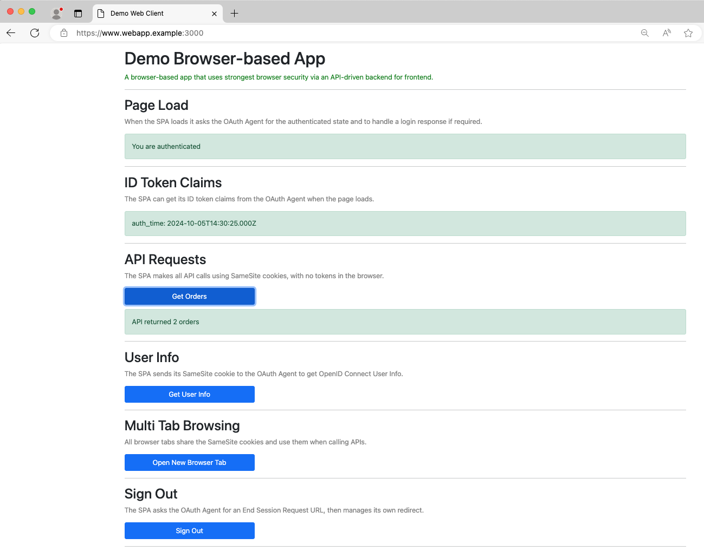

# Browser-based Application Code Example

A React app that runs a code flow to authenticate users and get an access token with which to call APIs.\
The access token is transported using an HTTP-only cookie, to help reduce XSS threats.

## Overview

Install Node.js 20 or later and then use the following commands to run the app.\
The webpack dev server runs at `https://www.webapp.example:3000` to serve the app's static content:

```bash
npm install
npm start
```

In your browser, navigate to `https://www.webapp.example:3000` to open the browser-based application.
Click on `Sign in` to start an OAuth flow and log in using one of these test credentials:

- User: `dana`, Password: `Password1`
- User: `kim`, Password: `Password1`

After you authenticate, run the lifecycle operations including secure API requests.\
Note that the two users have different permissions to API resources.\
After user authentication the app shows how to run API requests, token refresh and basic logout:



## Configuration

The app uses a JSON configuration file with its backend for frontend base URL:

```typescript
{
    "backendForFrontendBaseUrl": "https://api.webapp.example"
}
```

## Source Code Overview

The following table summarizes the application's main source files:

| Source File | Description |
| ----------- | ----------- |
| [index.tsx](src/index.tsx) | The entry point to the React app |
| [app.tsx](src/views/app/app.tsx) | The application shell |
| [appViewModel.ts](src/views/app/appViewModel.ts) | A view model that stores some permanent objects |
| [oauthClient.ts](src/oauth/oauthClient.ts) | Manages requests to the OAuth Agent |
| [apiClient.ts](src/api/apiClient.ts) | Manages requests to the API |
