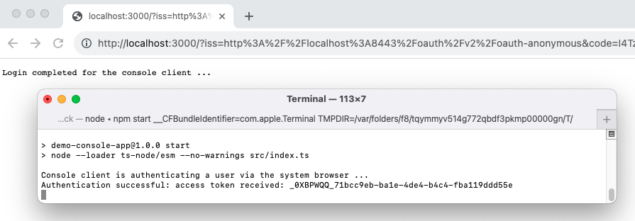

# Console App Code Example

A simple console app that runs a code flow to invoke the system browser.\
The example listens for the login response on a loopback URL.

## Run the App

Use the following commands to run the console app:

```bash
npm install
npm start
```

The app immediately runs a code flow and invokes the system browser.\
Login as the pre-shipped user account of `demouser / Password1` when prompted.

The app listens for the login response on an HTTP server.\
The HTTP server runs on a port such as 3001, resulting in a callback URL of `http://127.0.0.1:3001`.\
The simple demo app then outputs its access token and exits, whereas a real app would use it to call APIs:



## Security Behavior

The console app's [OAuthClient module](src/oauthClient.ts) shows how to implement a code flow.\
The implementation uses the following best practices:

| Behavior | Description |
| -------- | ----------- |
| response_type=code | No tokens are received in the browser response |
| state verification | The app validates responses to protect against cross site request forgery |
| PKCE | Proof key for code exchange is used, to protect against authorization code injection |
| ID token validation | The code validates ID tokens before accepting the token response, then saves its claims |
