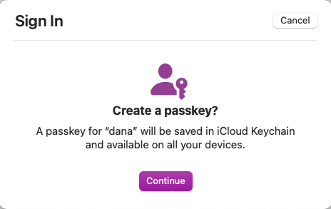
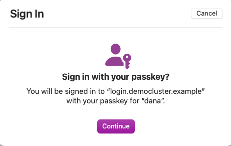

# Upgrade to Passwordless User Authentication

Follow these steps to harden the user authentication of the book's frontend code examples.\
First, ensure that you have already deployed the backend components, e.g from [chapter 13](../chapter-13-browser-based-apps/README.md).

## Deploy an SMTP Server

First deploy an instance of the maildev mock SMTP server.\
You can use this tool to receive one-time passwords in a mock email inbox that runs at `https://mail.democluster.example`.

```bash
kubectl -n authorizationserver apply -f mock-smtp-server.yaml
```

Then add the following value to the list of entries in your hosts file that point to the API gateway's external IP address:

```text
172.18.0.5 mail.democluster.example
```

## Configure Passkeys in the Authorization Server

Change authentication in the authorization server by signing in to the admin UI:

- URL: `https://admin.democluster.example/admin`
- User: `admin`
- Password: `Password1`

Use the `Changes / Upload` menu option to upload the `upgrade-authentication.xml` file, which makes these changes:

- Creates an email one-time password authenticator that integrates with the SMTP server.
- Adds a passkeys authenticator that uses the email authenticator for account recovery.
- Changes all frontend clients to only allow users to authenticate with passkeys.

Select the `Merge` and `Upload` option and then use `Changes / Commit` to save the configuration changes.

## Run a Frontend Application

You can then run any of the earlier frontend code examples and sign in using passkeys:

- [Browser-based Application](../chapter-13-browser-based-apps/browser-based-application/README.md)
- [Console Application](../chapter-12-platform-specific-apps/console-app/README.md)
- [Desktop Application](../chapter-12-platform-specific-apps/desktop-app/README.md)
- [Android Application](../chapter-12-platform-specific-apps/android-app/README.md)
- [iOS Application](../chapter-12-platform-specific-apps/ios-app/README.md)

On mobile platforms you may get best results using passkeys on real devices rather than emulators.

## Create a Passkey

When prompted in the authorization server login screen, create a passkey and enter one of the test usernames, `kim` or `dana`.\
When you receive a form that prompts for a one-time code, browse to `https://mail.democluster.example` and copy the value into the form.\
Then follow the operating system prompt to perform the registration ceremony and create a passkey:



## Login with a Passkey

On all subsequent logins, you can sign in without any passwords, e.g. using a biometric to unlock secure storage.\
You authenticate at the authorization server using MFA with strong asymmetric cryptography:


